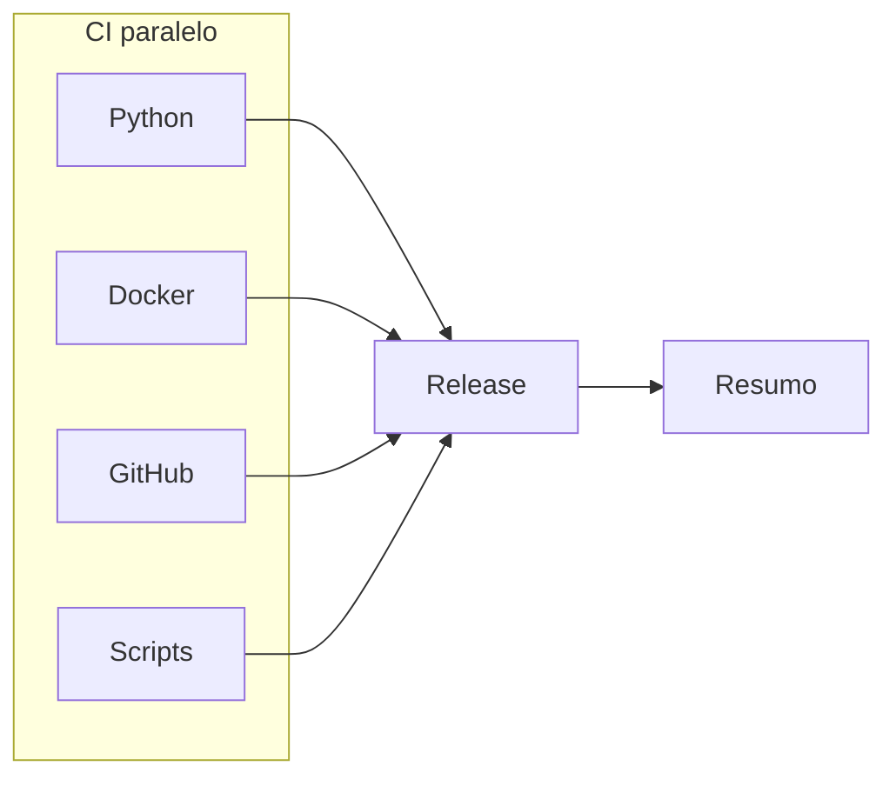

# GitHub Actions

Pipelines de integracao e release da PoC OTRS → Google Chat.

Documentacao completa: [docs/devops.md](../docs/devops.md).

## Visao (push em `main`)



## Composite actions

```text
.github/actions/
├── shared/pipeline-summary/
└── ci/
    ├── setup-python/
    ├── validate-docker/
    ├── validate-github/
    ├── validate-scripts/
    ├── release/
    └── sync-tags/
```

## Secrets

| Secret | Uso |
|--------|-----|
| `GITHUB_TOKEN` | Release e Gitleaks |
