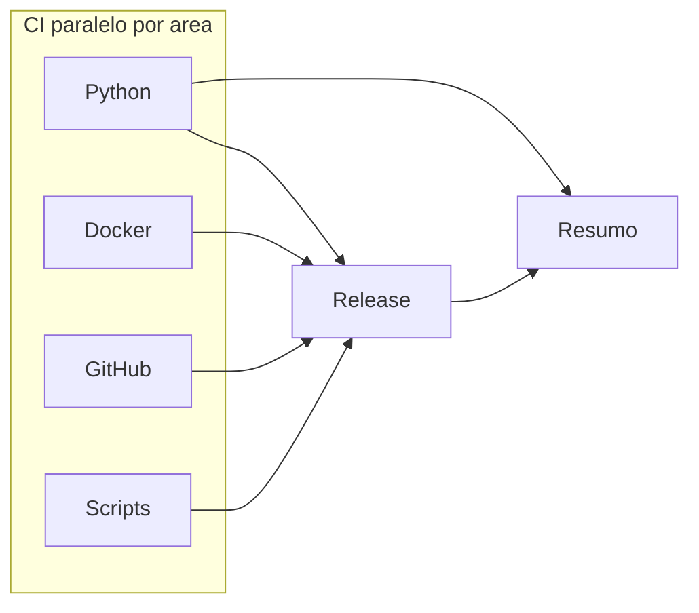

# DevOps e CI/CD

Pipelines de integracao e release da PoC OTRS → Google Chat.

## Visao do pipeline (push em `main`)



| Fase | Job | Notas |
|------|-----|-------|
| CI | Python / Docker / GitHub / Scripts | Orquestrador + stages iguais ao pre-commit (`fail_fast`) |
| Release | Semantic release | Apos gates verdes em `main` |
| Resumo | Status no GitHub Summary | Sempre no push `main` |

Sem Kubernetes, Terraform, Azure OIDC ou destroy: a PoC sobe via Compose local (`make docker-up`).

## Workflows

| Workflow | Gatilho | Uso |
|----------|---------|-----|
| [ci.yml](../.github/workflows/ci.yml) | push/PR `main`, manual | CI matriz; release no push `main` |

## Composite actions

```text
.github/actions/
├── shared/
│   └── pipeline-summary/
└── ci/
    ├── setup-python/
    ├── validate-docker/
    ├── validate-github/
    ├── validate-scripts/
    ├── release/
    └── sync-tags/
```

## Stages crash-first

Em cada area o orquestrador `app/scripts/operations/clean_workspace.py` executa:

`Lint` → `Seguranca` → `Testes` → `Validate` → `Build`

```bash
python app/scripts/operations/clean_workspace.py --area python --stage lint
python app/scripts/operations/clean_workspace.py --area docker --stage build
```

| Area | Lint | Seguranca | Testes | Validate | Build |
|------|------|-----------|--------|----------|-------|
| python | Ruff, mypy, vulture, limite 300 | Bandit, pip-audit (+ Gitleaks no job) | pytest cov 100% | `pip install -e` + import | `python -m build` |
| docker | Hadolint (`infra/docker/.hadolint.yaml`) | Trivy config/fs | `compose config --quiet` (`.env` ou `.env.example`) | arquivos + compose | build da imagem **notifier** |
| github | actionlint | Gitleaks em `.github` | actionlint | estrutura de actions | diretorios ci/shared |
| scripts | `bash -n` + `make -n help` | grep de segredos | `make help` | scripts do Makefile | sintaxe shell |

## Pre-commit

Espelha a matriz CI (sequencial com `fail_fast`): commitlint + areas Python/Docker/GitHub/Scripts nos stages Lint → Seguranca → Testes → Validate → Build. Detalhes: [linters/README.md](../linters/README.md).

## Secrets

| Secret | Uso |
|--------|-----|
| `GITHUB_TOKEN` | Release, sync-tags e Gitleaks (fornecido pelo Actions) |

## Operacao

### Push em `main`

1. CI paralelo por area.
2. Release semantica se todos os gates passarem.
3. Marcador `[skip-cd]` na mensagem do commit: so CI; sem release.
4. `workflow_dispatch` com `skip_cd=true`: so CI.

### Pull request

Somente jobs CI por area (sem release).

## Relacionados

- [engineering-python.md](engineering-python.md)
- [infra-docker.md](infra-docker.md)
- [arquitetura.md](arquitetura.md)
